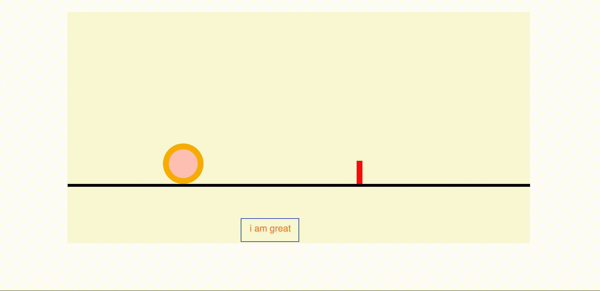

# D3 workshop - part 0 - svg's



This workshop is in two sections, section one is a code along, section two is exercises for the students to do in pairs.

## code along

clone the repo and _do not look in the solutions file_

### Step One - append svg

```js
const svgWidth = 800;
const svgHeight = 400;

const svg = d3
  .select('#chart')
  .append('svg')
  .attr('width', svgWidth)
  .attr('height', svgHeight);
```

talking points:

- select and append create /change the selection (i.e. what the code after it applies to. so here we select the div with id = 'chart', then we append the svg and this moves the selection onto the svg, so when we set the width and height that is applied to the svg)
- we try to avoid magic numbers so create variables for width and height

### Step Two - add a bottom line

```js
const bottomLine = 300;
const bottomLineWidth = 5;

svg
  .append('line')
  .attr('x1', 0)
  .attr('x2', svgWidth)
  .attr('y1', bottomLine)
  .attr('y2', bottomLine)
  .attr('stroke', 'black')
  .attr('stroke-width', bottomLineWidth);
```

talking points:

- each svg element has different properties it needs so look at MDN page for [that svg element](https://developer.mozilla.org/en-US/docs/Web/SVG/Element/line)

### Step Three - add a circle to the bottom line

```js
const circleRadius = 30;

svg
  .append('circle')
  .attr('cx', 200)
  .attr('cy', bottomLine)
  .attr('r', circleRadius)
  .attr('fill', 'pink');
```

talking points:

- again look at [mdn page](https://developer.mozilla.org/en-US/docs/Web/SVG/Element/circle) to know what attributes to give it
- look in browser to see where this code positions the circle
- talk about how y:0 is at the top, and circles and lines are drawn from the center

alter cy to be

```js
  .attr('cy', bottomLine - circleRadius)
```

there is still an overlap because the bottomLine value refers to the center of the line, but the line is thick, so we need to minus half of the thickness to position the circle on the bottom line so that there is no overlap:

```js
  .attr('cy', bottomLine - circleRadius - bottomLineWidth / 2)
```

### Exercises in pairs

**note**: when it says 'on the bottom line', it wants the shape to be sat on the line with no overlap

1. Add a 10px orange border to the circle and make it so that it is still on the bottom line. hint: borders are half on inside and half on outside of shape.
2. Add a small red rectangle to the bottom line (x: 500, width: 10, height: 40)
3. Add a group to the svg with a class of 'group-1' (it will be invisible so check the elements tab to check you have successfully added it)

4. We now need to add a rectangle to this group. To do this we must first select the group and then append to it. The rectangle should have no fill and a blue border, with attributes: (width:100 height:40 x:300 ). Put this rectangle on the bottom line
5. We now want to add text to the group, again we will first have to select the group and append to it. We want the text to say 'i am great', position the text so that it is inside the blue box and style it so that it is color:coral and font:sans-serif
6. Now we want to move the group down below the line, at the bottom of the grey box. Do this without editing the y coordinates of the text and rectangle. (hint: you cannot give group elements x and y coordinates)
7. Wrap the code you wrote for question 7 in a setTimeout with a delay of 1000ms so you can see it move

### If you have time:

8. add .transition() somewhere in the setTimeout code to make the movement smoother (you have to work out where to put it!)
9. add .duration() somewhere in the setTimeout code to make the duration last 2 seconds
10. add .ease() somewhere in the setTimeout code to make the transition look different (look at https://github.com/d3/d3-ease)
